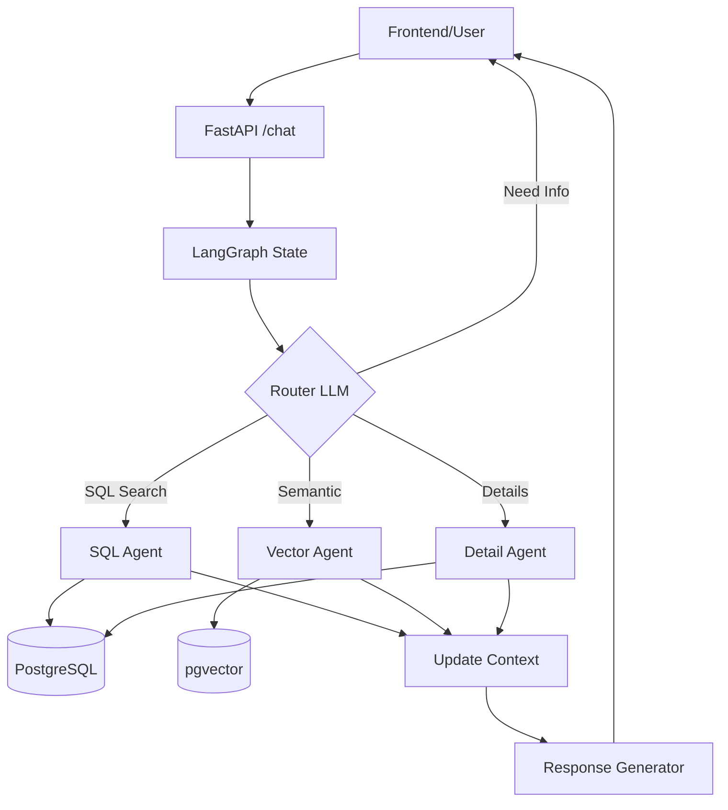

# System Architecture & Detailed Implementation Plan

**Role:** Solution Architect & Business Analyst
**Date:** 2026-02-02
**Version:** 1.0

---

## 1. Executive Summary & Design Evaluation

After reviewing the initial `system_design.md`, I confirm that the foundational logic is **excellent and ready for implementation**. The proposed "Orchestrator Pattern" with a "Gateway Router" is the industry standard for scalable Agentic AI systems (similar to architectures used in LangGraph).

### ✅ What is Strong:

- **Database Schema**: The 3NF Normalization (`brands`, `products`, `product_variants`) is perfect. It separates "static knowledge" for vectors from "dynamic inventory" for SQL, solving the classic stale-data problem in RAG.
- **Clarification Loop**: The logic of the Router _asking back_ instead of delegating to a separate agent is highly efficient for latency.
- **Use Case Segmentation**: Clear distinction between _Hard Search_ (SQL), _Soft Search_ (Vector), and _Deep Dive_ (Lookup) avoids "using a hammer for a screw".

### 🚀 Optimization Opportunities (Added to this Plan):

1.  **Strict State Management**: We need a formal `State` schema to pass context (e.g., `current_product_id`, `chat_history`) between turns.
2.  **Safety & Validation**: Added a validation layer for SQL generation to prevent injection or invalid queries.
3.  **Hybrid Search Strategy**: For the "Consultant" case, strictly Vector might miss specific constraints (e.g., "Moisturizing lipstick under $20"). We will use **Hybrid Search** (Vector + Metadata Filter).

---

## 2. Next Steps: Implementation Roadmap

Now that data is in the database, here is the exact step-by-step plan:

### Phase 1: Foundation (Days 1-2)

- [ ] **Data Verification**: Ensure `pgvector` extension is enabled and embeddings are generated for `products.description`.
- [ ] **Backend Skeleton**: Install `langchain`, `langgraph`, `psycopg2`, `asyncpg`.
- [ ] **State Definition**: Define the `AgentState` TypedDict.

### Phase 2: Tooling Layer (Days 3-4)

- [ ] **SQL Tool**: Build `SafeSQLTool` with read-only permissions and schema-awareness.
- [ ] **Vector Tool**: Build `RetrieverTool` using Cosine Similarity on `products`.
- [ ] **Testing**: Verify tools return correct JSON for sample queries.

### Phase 3: The Brain (Days 5-7)

- [ ] **Router Agent**: Implement the Prompt Engineering for Intent Classification & Slot Filling.
- [ ] **Workflow Construction**: Use LangGraph to wire `Router` -> `Tools` -> `Response`.
- [ ] **Memory Integration**: Connect PostgreSQL/Redis for persisting session history.

### Phase 4: API & Client (Day 8+)

- [ ] **FastAPI Endpoints**: Expose `/chat` endpoint streaming responses.
- [ ] **Frontend Integration**: UI that handles markdown and potentially "Product Card" UI components.

---

## 3. Detailed Agent Specifications

We will use **LangGraph** to implement this. Below are the precise specifications for the agents.

### A. The Schema (Shared State)

This state is passed between all nodes in the graph.

```python
from typing import TypedDict, List, Optional, Annotated

class AgentState(TypedDict):
    # Chat History
    messages: List[BaseMessage]

    # Context (Short-term memory)
    current_intent: Optional[str]        # 'FIND', 'ADVISE', 'DETAIL', 'COMPARE'
    context_product_ids: List[str]       # List of IDs currently discussed (e.g. from previous search)

    # Slot Filling (For Router)
    missing_info: Optional[List[str]]    # e.g. ['price', 'tone']

    # Output
    final_response: Optional[str]
```

### B. The Orchestrator (Router)

**Role**: Gatekeeper & Dispatcher.
**Model**: Fast & Cheaper (e.g., Gemini 1.5 Flash / GPT-4o-mini).

**System Prompt Draft:**

```text
You are the reception AI for a premium lipstick shop.
Your goal is to route the user to the correct specialist or ask for clarification.

AVAILABLE INTENTS:
1. SEARCH: User has specific criteria (brand, price, exact color name).
2. ADVISE: User describes a look, feeling, occasion, or problem (dry lips, party).
3. DETAIL: User asks about a specific product mentioned previously (ingredients, usage).
4. COMPARE: User compares two specific products.

RULES:
- If the user request is vague (e.g., "I need a lipstick") -> Return status "CLARIFY" and ask a polite question to narrow down (Budget? Preferred Tone?).
- If the user asks about "it" or "that one", check the dialogue history to identify the product.
- Always be polite and concise.

OUTPUT JSON FORMAT:
{
  "intent": "SEARCH" | "ADVISE" | "DETAIL" | "COMPARE" | "CLARIFY",
  "clarification_question": "...", (Only if intent is CLARIFY)
  "extracted_entities": { "brand": "...", "price_range": "...", "tone": "..." }
}
```

### C. The Search Specialist (SQL)

**Role**: Translate natural language to SQL.
**Model**: Strong Reasoning (e.g., Gemini 1.5 Pro).

**Tools Access**:

- `check_inventory`: Check stock in `product_variants`.
- `search_products_sql`: Execute SELECT on `product_variants` JOIN `products`.

**Critical Logic**:

- **Validation**: The tool must reject DELETE/DROP/UPDATE commands.
- **Limit**: Always enforce `LIMIT 5` to avoid flooding the context.

### D. The Consultant (Vector/RAG)

**Role**: Semantic recommendation.
**Model**: Creative (Temp 0.7).

**Implementation Detail**:

- **Chunking**: None needed. Each `product` row (description + highlights) is one vector.
- **Search Type**: Hybrid.
  - _Step 1_: Filter by "hard" constraints if any (e.g. `brand='MAC'`).
  - _Step 2_: Vector search within that subset.
  - _Why?_ Prevents suggesting a $50 lipstick when user asked for "cheap moisturizing lipstick".

### E. The Product Expert (Detail)

**Role**: Extract specific info.
**Model**: High Precision (Temp 0.0).

**Data Source**:

- Uses `product_id` to query `products` table directly.
- **RAG?** Not really. It reads the full row (description/ingredients are usually < 2k tokens, fitting easily in context) and answers the question.

---

## 4. Use Case Coverage Matrix

| Use Case          | User Query Example                        | Routing Path        | Technical Action                                                                         |
| :---------------- | :---------------------------------------- | :------------------ | :--------------------------------------------------------------------------------------- |
| **Direct Search** | "Revlon red lipstick under $10"           | Router -> `SEARCH`  | SQL: `SELECT * FROM variants WHERE brand='Revlon' AND color LIKE '%red%' AND price < 10` |
| **Advice**        | "Something for dry lips for a night date" | Router -> `ADVISE`  | Vector Search: Query "hydrating night date" on `products` table. Return Top 3.           |
| **Clarification** | "I want a lipstick"                       | Router -> `CLARIFY` | Bot: "Sure! Do you prefer a matte or glossy finish?"                                     |
| **Deep Dive**     | "Does that Revlon one have lead?"         | Router -> `DETAIL`  | Retrieve `ingredients` for Revlon ID. LLM analyzes text.                                 |
| **Stock Check**   | "Is the second one in stock?"             | Router -> `SEARCH`  | Resolve "second one" from `context_product_ids`. Check `availability` col.               |

## 5. Deployment Architecture


